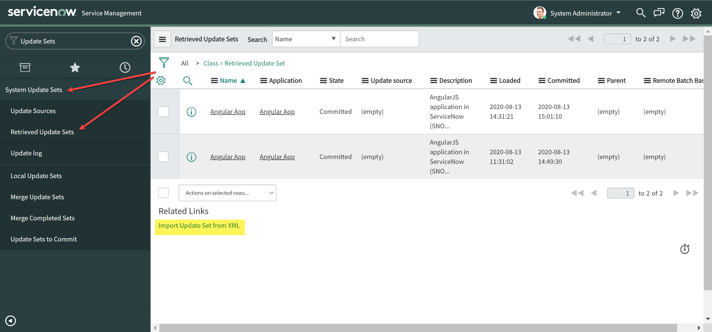
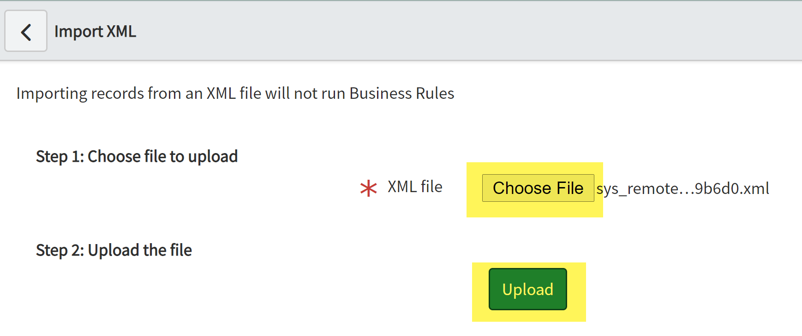
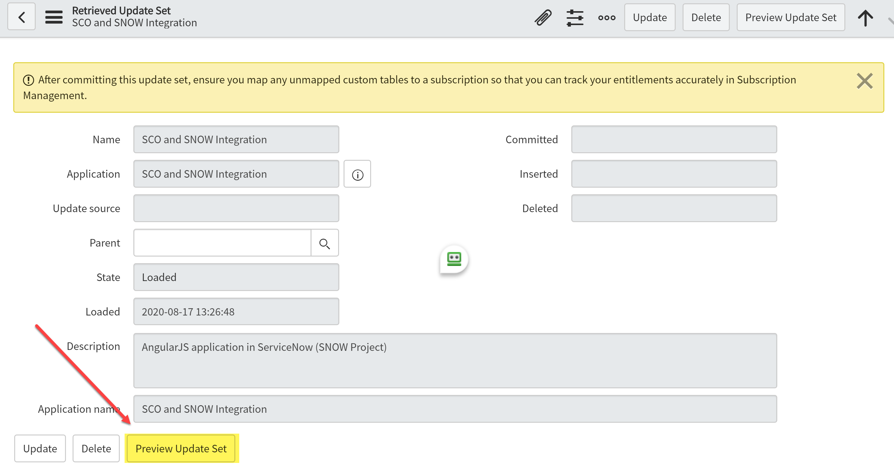
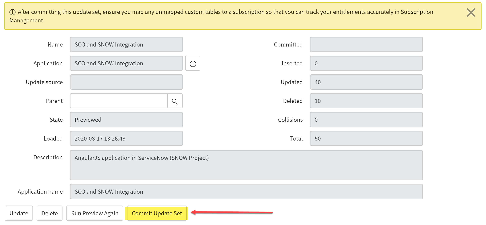
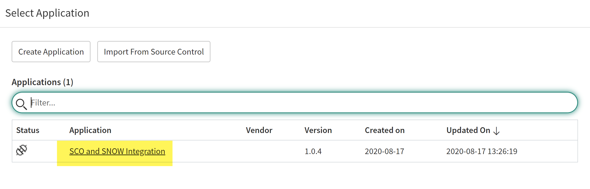
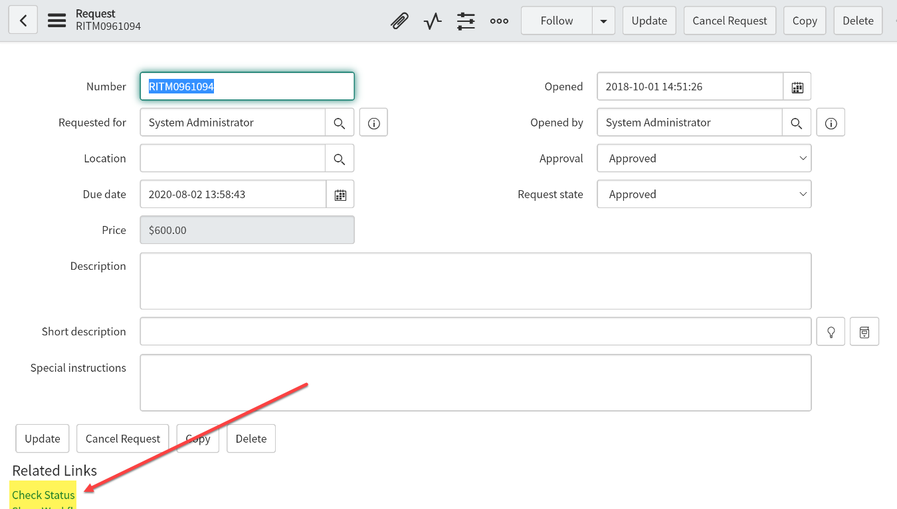
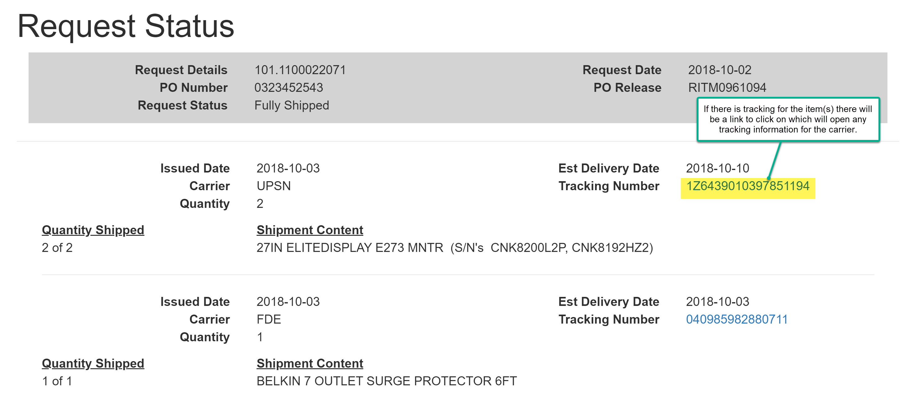
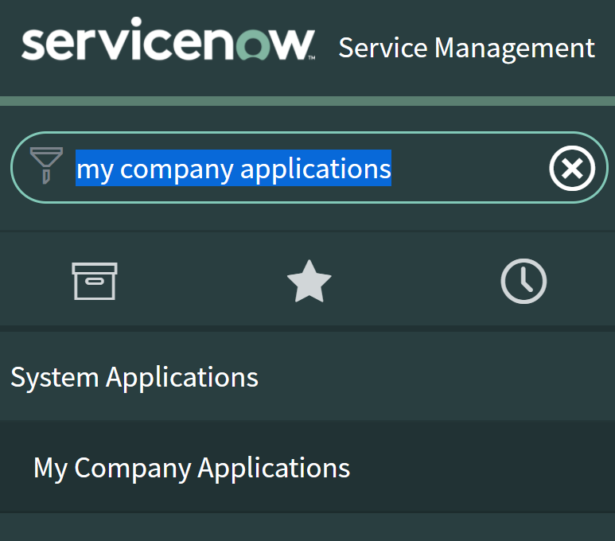
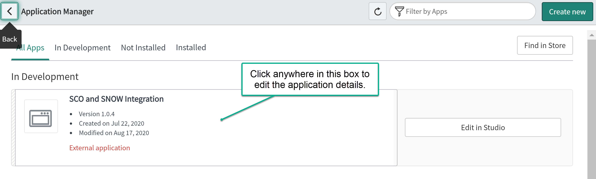

## **SCO ServiceNow Integration**
## **Application - Installation and Update Guide**

## Table of Contents

[Change History](#_Toc48720716)

[Procedure Description](#_Toc48720717)

[Installing Application](#_Toc48720718)

[Retrieving an Update Set](#_Toc48720719)

[Set Application Properties](#_Toc48720720)

[Test Application](#_Toc48720721)

[Uninstalling Application](#_Toc48720722)

[Search for the Application](#_Toc48720723)

[Open the Application Page](#_Toc48720724)

[Delete the Application](#_Toc48720725)

## Change History

| **Version** | **Change Date** | **Made By** | **Description of Change** |
|:---:|:---:|:---:|---|
| 1.0         | 8/17/2020       | Guy Davis   | Initial documentation     |

## Procedure Description

This guide documents the steps for installing or updating the Insight ServiceNow application on a ServiceNow instance. All examples are for the Paris release of ServiceNow although the steps should work for the majority of recent ServiceNow releases.

The process for installing or updating the application is the same. There are 3 steps.

1. Retrieve the update set
2. Set the application properties
3. Test application

A ServiceNow update set is an XML file that contains a group of configuration changes that can be moved from one instance to another. This feature allows administrators to group a series of changes into a named set and then move them as a unit to other systems for testing or deployment.

The SCO ServiceNow Integration Application is packaged as a ServiceNow Update set and will be included with this documentation.

Note: Unless otherwise specified all instructions should be performed by a ServiceNow administrator.

## Installing Application

## Retrieving an Update Set

#### Description

To retrieve and update set first login to your ServiceNow instance and navigate to System Update Sets and then to Retrieved Sets.

Click the Import Update Set from XML link at the bottom of the list. Click Choose File and select the XML file you downloaded, then click Upload.

Open the update set you just uploaded, from the list of retrieved update sets.

Next preview the update set by clicking the **Preview Update Set** button.

If there are any preview errors, you&#39;ll have to resolve those errors before committing the update set.

Finally click on the **Commit Update Set** button to either install the application or install any application changes.

#### ServiceNow Documentation
[Retrieve an Update Set](https://docs.servicenow.com/bundle/paris-application-development/page/build/system-update-sets/task/t_RetrieveAnUpdateSet.html)

## Set Application Properties

#### Description

After you have retrieved and committed the update set the application should now be available for use.

Navigate to System Applications and then to Studio. From the list choose the **SCO and SNOW Integration** application.

NOTE: If you are installing an update to the application you should verify the version number is greater than the current version installed.

This will open the application for modification. In the navigation menu there will be a section labelled Properties. There are 3 properties in the application which are client\_id and client\_key and production.

#### Application Properties

| **Property** | **Description**                                      | **Type** | **Required?** |
|--------------|------------------------------------------------------|:--------:|:-------------:|
| client\_id   | Client ID assigned during setup                      | NUMBER   | Yes |
| client\_key  | Base 64 key used for authentication                  | CHAR | Yes |
| production   | Use production url to retrieve requests (true/false) | Boolean | Yes |

#### ServiceNow Documentation

[ServiceNow Studio](https://docs.servicenow.com/bundle/paris-application-development/page/build/applications/concept/c_ServiceNowStudio.html)

## Test Application

#### Description

After the application has been installed navigate to a request in which some Insight items have been ordered. When you view the request you will see a **Check Status** link in the **Related Links** section of the screen.

When you click on this link a new page is opened which will display the current status of the request.

## Uninstalling Application

#### Description

If for any reason the application is to be removed from ServiceNow you can do this very quickly. The steps are:

1. Search for the application
2. Delete the application

## Search for the Application

#### Description

In the ServiceNow interface if you search for **My Company Applications** and then click on the link with the same name a screen is returned with all of the custom applications installed for your company.

## Open the Application Page

#### Description

After you have opened your company applications you will see an application with the title **SCO and SNOW Integration**. Click anywhere within the application box to see the application details.

## Delete the Application

#### Description

Once the application page is scroll down and just above the **Related Links** section there is a delete button. Click on it and confirm the deletion.

#### ServiceNow Documentation

[Application List](https://docs.servicenow.com/bundle/paris-application-development/page/build/applications/concept/c_ApplicationList.html)

